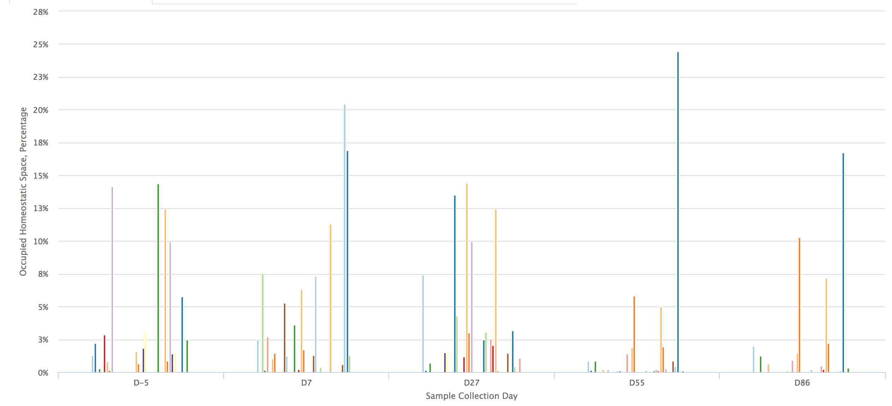
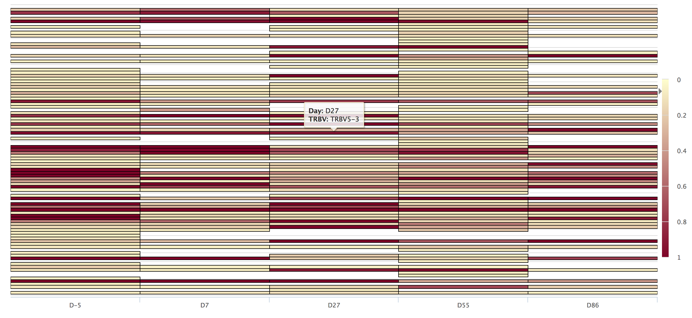

# TCR Repertoire
Ideas for interactive TCR repertoire visualisation
## Description
TCR repertoire analysis allowed by new generation sequencing techniques delivers accurate measurements of TCR diversity. T cell recovery and recovery of the T cell receptor diversity might have serious implications on relapse and infection risk in cancer patients. Longitudinal clinical studies of the changes in TCR repertoire might shed some light on the recovery process of patients and indicate if there are predictable trends in the TCR repertoire fluctuations. 
##Challenges
Computational challenges associated with TCR diversity data collection lie in the ability to deliver accurate and simple plots that allow healthcare professionals to easily establish trends in the TCR repertoire fluctuations over time. Interactive javascript visualisation is one of the approaches. 
##Ideas
I embedded the plot ideas from below into a shiny app for easier cycling between patients and samples.
#### Diversity
ggplot2 diversity plots utilising different statistical measurements for diversity.
#### Clonotype comparison 
Interactive longitudinal comparison of individual TCR clones (RCharts). Plots are zoom enabled and, reactive to click and hover.

#### Spectratypes
Using statistical tests of normality (example Shapiro-Wilk test), spectratype plots of different TRBV genes can be visually simplified in a heatmap.

